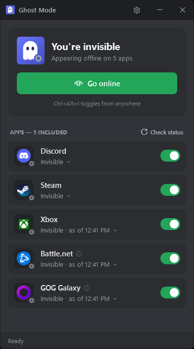

<h1 align="center">Ghost Mode</h1>

Appear offline on Discord, Steam, Xbox, Battle.net and GOG Galaxy at the same time, with one click or one hotkey.

## What it does

Each of these apps has its own "invisible" or "appear offline" setting buried in a different menu. Ghost Mode flips
all of them for you:

- **One button** to go invisible everywhere, and one to come back online.
- **Pick which apps are included** with the switch next to each one. Apps that aren't running are skipped automatically.
- **See your status in each app** at a glance, and click any app's status to change just that one.
- **Optional hotkey** (Ctrl+Alt+I) that works from anywhere, even when Ghost Mode isn't open.
- Lives quietly in the **notification area** (system tray) and can **start with Windows**.

Supported apps: **Discord**, **Steam**, **Xbox** (the Xbox app for PC), **Battle.net** and **GOG Galaxy**.

## Download and install

1. Go to the [**latest release**](../../releases/latest) and download the `GhostMode-<version>.zip` file under
   **Assets**.
2. Extract it to a folder you'll keep, for example `Documents\Ghost Mode`. Keep both files together.
3. Double-click **GhostMode.exe**.

There's no installer and nothing else to install. It works on Windows 10 and 11.

> **"Windows protected your PC"?** Ghost Mode isn't code-signed, so Windows SmartScreen shows this warning the first
> time. Click **More info**, then **Run anyway**. Some antivirus programs may also be wary of it, because it clicks
> menus in other apps for you.

On first launch you'll be asked which extras you'd like: a Start Menu shortcut, a Desktop shortcut, the Ctrl+Alt+I
hotkey, and starting with Windows. All are off unless you switch them on, and you can change them later from the
**gear** in the top-right corner.

## Using it

- **Go invisible / Go online**: the big button. While every included app shows you online it says **Go invisible**;
  once you're invisible everywhere it says **Go online**. If your apps are mixed (some invisible, some online), you
  get both buttons side by side, so either direction is one click. The tray icon's menu offers the same choices.
  Ctrl+Alt+I goes invisible when your apps are mixed.
- **Switches** next to each app choose whether that app is included when you press the big button.
- **Click an app's status** (e.g. "Online ⌄") to set just that app to Online or Invisible.
- **Check status** takes a fresh look at apps whose status Ghost Mode can't see in the background (see below).
- **Ctrl+Alt+I** toggles everything from anywhere, if you turned the hotkey on. A notification tells you when it's done.
- **Closing or minimising** the window sends Ghost Mode to the notification area. Click its icon there to open it
  again, or **right-click it and choose Exit** to quit.

Changing your status takes around 15 seconds for all five apps.

### Where the status comes from

- **Discord** and **Steam** are always shown live.
- **Battle.net** and **GOG Galaxy** are shown live while their windows are open. Otherwise you'll see the last known
  status, for example "Invisible · as of 3:41 PM".
- **Xbox** always shows the last known status. Use **Check status** to refresh it.

## Things to know

- **Your mouse will move on its own**, and app windows will pop up for a moment while Ghost Mode works. Let it
  finish (about 15 seconds) before you carry on. **Don't use it in the middle of a game**, especially a fullscreen
  one, because it needs to bring other windows to the front.
- **English only.** Ghost Mode finds Discord's and the Xbox app's menus by their English names. If either app is set
  to another language, it won't be able to change that app.
- **Battle.net and GOG Galaxy can't be read by other programs**, so Ghost Mode clicks where their menus normally
  are and checks the colour of your status dot to confirm it worked. If either app is redesigned, this can stop
  working. Ghost Mode will say "Couldn't change" rather than pretend it succeeded.
- **Battle.net's close setting matters.** Ghost Mode puts Battle.net back in the tray by closing its window. That's
  Battle.net's default behaviour, but if you've set Battle.net to exit completely when its window is closed, it will
  quit instead. You'll find this under Battle.net's **Settings → App**.
- **Standard installs only.** Battle.net must be installed in its default folder, and only the regular Discord app
  is supported (not Discord PTB or Canary).
- **Custom statuses.** If you have a custom status set in Discord, Ghost Mode can still change your status but shows
  it as "as of …" instead of live.
- **Apps running as administrator** can't be controlled by Ghost Mode unless you run it as administrator too.

### Is it safe for my accounts?

Ghost Mode never asks for, reads or stores any passwords or account tokens, and it doesn't connect to the internet.
It only clicks the same status menus you would. Steam is changed through Steam's own built-in status link.

## Troubleshooting

- **An app says "Couldn't change"**: make sure the app is open and signed in, then try again. If it keeps failing
  for Battle.net or GOG Galaxy, the app's layout has probably changed.
- **The hotkey doesn't work**: open the gear menu and switch **Ctrl+Alt+I hotkey** off and on again. Another program
  may already use Ctrl+Alt+I; you can choose a different key in the Properties of the *Ghost Mode - Toggle* shortcut
  in your Start Menu.
- **Something else**: there's a log at `%APPDATA%\GhostMode\log.txt` (paste that into File Explorer's address bar).

## Uninstall

1. Open the gear menu and switch everything off. This removes the shortcuts and the start-with-Windows entry.
2. Right-click the Ghost Mode icon in the notification area and choose **Exit**.
3. Delete the Ghost Mode folder, and `%APPDATA%\GhostMode` if you want to remove its settings too.

## For developers

See [DEVELOPING.md](DEVELOPING.md) for how it's built and how to add support for another app.

## License

Ghost Mode is free and open source under the [MIT License](LICENSE).
